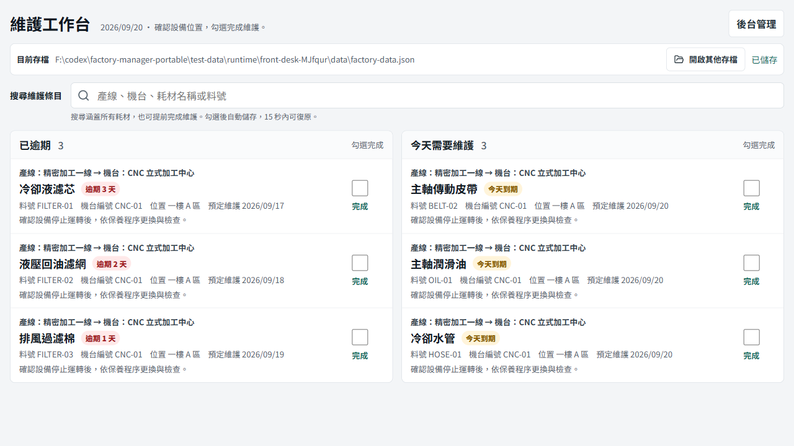

# Factory Manager Portable


Factory Manager Portable is an Electron desktop app for managing factory production lines, machines, consumables, and recurring maintenance reminders in a portable JSON file.



## Features

- Choose a save file, then enter the maintenance front desk by default. Use **後台管理** to access the existing production-line, machine, and consumable editor, and **返回前台** to return.
- See overdue items and items due today in separate lists, each showing its production line and machine.
- Compact desktop layout places the two lists side by side. Six typical items (three per list) fit at 1280×720 or 1024×768 without scrolling; narrow windows stack the lists, and larger datasets remain scrollable without clipping content.
- Search all consumables by production line, machine name/code, consumable name, or SKU, including future maintenance items.
- Check an item to save today's maintenance and recalculate its next due date. Each completion can be undone for 15 seconds while staying in the front desk; switching files or entering administration clears these temporary undo actions. Search results show items completed today as checked.
- Create, edit, and delete production lines, machines, and consumables.
- Store factory data in a portable JSON file that can be opened on another packaged build.
- Create a new data file, open an existing file, or load the default runtime data file.
- Validate the saved JSON shape with Zod before writes complete.
- Keep a backup copy before replacing the current data file.
- Show maintenance status as normal, due soon within seven days, or due now.
- Enter past service dates and planned maintenance dates in Gregorian `YYYY-MM-DD` format.
- Complete today's maintenance and recalculate the next reminder using local calendar days.
- Copy and paste production lines, machines, and consumables; copies have independent IDs and no service dates.
- Move items up and down while retaining the current selection.
- Keep input focus and unsaved drafts during saves, with native desktop copy/paste and Chinese edit menus.
- Adapt the workspace to narrow windows and display sizes without horizontal scrolling.

See [the usability review](docs/usability-review-2026-09-08.md) for changes, verification, and remaining manual checks.

## Build and Run

Requirements:

- Node.js and npm.
- The dependencies declared in `package.json`.

Install dependencies:

```powershell
npm install
```

Run the development desktop app:

```powershell
npm run dev
```

Run the Vitest suite. The `test` script is `vitest run`, so this command executes the non-watch test run:

```powershell
npm test
```

Build the renderer and Electron main process:

```powershell
npm run build
```

Create packaged builds:

```powershell
npm run package:win
npm run package:mac
npm run package:linux
```

The default runtime data path is `data/factory-data.json`. In development it is resolved from the current working directory. Windows single-file portable builds use the original launcher directory (`PORTABLE_EXECUTABLE_DIR`), not the temporary extraction directory. Other builds resolve it next to the executable, with a macOS app bundle adjustment in `electron/factoryData.ts`.

## Project Structure

- `electron/` - Electron main process, preload bridge, file dialogs, and JSON data access.
- `shared/` - shared Zod schemas, TypeScript data types, and maintenance reminder logic.
- `src/` - React user interface and styling.
- `tests/` - Vitest unit and component tests.
- `index.html` - Vite HTML entry point.
- `package.json` - npm scripts, dependencies, and electron-builder configuration.
- `package-lock.json` - locked npm dependency tree.
- `vite.config.ts` - Vite renderer build configuration.
- `vitest.config.ts` - Vitest and jsdom test configuration.
- `tsconfig.json` - renderer TypeScript configuration.
- `tsconfig.electron.json` - Electron TypeScript configuration.

## Download

Published builds are available on [GitHub Releases](https://github.com/Ansenchen123/factory-manager-portable/releases). Local builds are written to `release/`.

## 摘要

- Factory Manager Portable 是 Electron 桌面工具，用於管理產線、機台、耗材與維護提醒。
- 資料以可攜 JSON 檔保存，可建立新存檔、開啟既有存檔，或使用預設執行期路徑。
- npm test 會執行 package.json 中的 vitest run 測試指令。
- 打包指令包含 Windows、macOS 與 Linux，設定由 package.json 的 electron-builder 區塊定義。
- 公開版本請見 GitHub Releases；本機打包結果位於 `release/`。

## Desktop smoke test

With Playwright installed in your development environment (or available through `NODE_PATH`), run `npm run build`, start `npm run dev:renderer` on port 5173, then run:

```powershell
node scripts/desktop-smoke.cjs
```

The test creates an isolated run directory under `test-data/runtime/` for its data, profile, and screenshots, exercises real Electron file persistence and native clipboard shortcuts, and prints the run directory in its output. It does not open existing factory data. Chinese IME mode still needs a manual check with the input method used on the target computer. The drag smoke test (`node scripts/drag-smoke.cjs`) uses the same runtime directory convention. See [test data conventions](test-data/README.md).

Run `node scripts/front-desk-smoke.cjs` with the same prerequisites to verify the front desk using real Electron file writes: overdue/today lists, search, completion, undo, reopening the save, keyboard focus, administration switching, and layouts from 320 to 1440 pixels. All smoke tests use isolated data and leave screenshots under `test-data/runtime/`.

## CodeGraph

This project uses a local CodeGraph index for code navigation. With the CodeGraph CLI installed, run `codegraph init .` on a fresh checkout, `codegraph explore "getMaintenanceInfo"` to inspect code, and `codegraph sync` after code changes. Use `codegraph status` to check the index. Generated index databases stay local; repository-wide agent rules are in [AGENTS.md](AGENTS.md).
